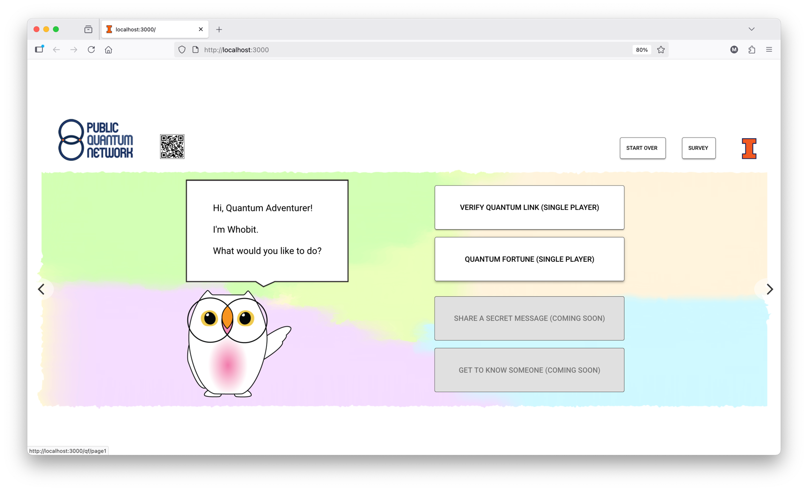
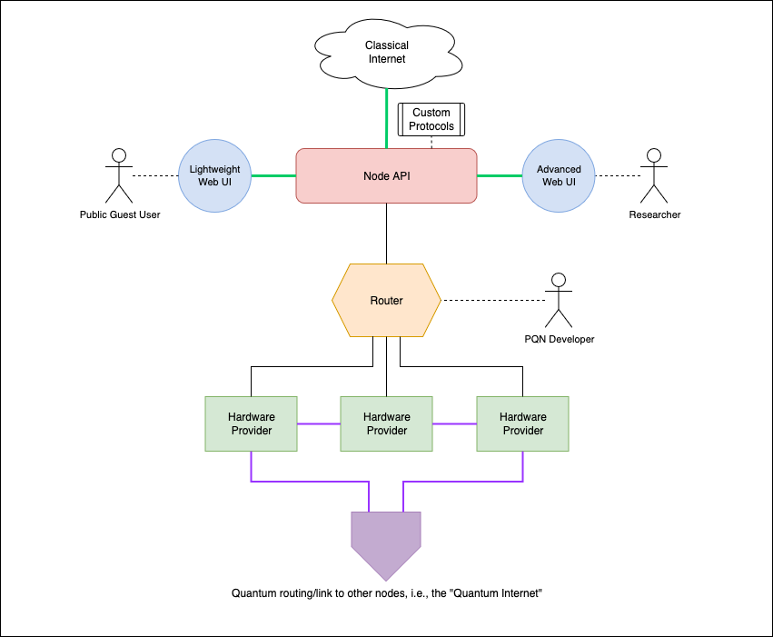

# PQN Stack

**Software stack for Public Quantum Network (PQN) nodes**

[](https://opensource.org/licenses/MIT)
[](https://www.python.org/downloads/)

A distributed node based approach to quantum networks. This repository hosts all the code necessary to make nodes of the PQN function (except for the frontend located [here](https://github.com/PublicQuantumNetwork/pqn-gui)).


<p align="center">
  
  <br>
  <em>PQN web interface for public interaction with a quantum network</em>
</p>

> [!WARNING]
> **Early Development**: This package is in early stages of development. APIs, installation procedures, and distribution methods are subject to change. Use in production environments is not recommended at this time.

## Node Architecture

<p align="center">
  
  <br>
  <em>PQN web interface for monitoring and controlling quantum network nodes</em>
</p>

Our Node is composed of multiple components. All components inside a node are part of an in internal intranet with no external world access except for quantum links to other hardware or the _Node API_.

* **Node API**: FastAPI based, handles communications with web-ui as well as Node to Node communication. Only component in a Node than can talk to other components and the outside world. Resides in [src/pqnstack/app/main.py](https://github.com/PublicQuantumNetwork/pqn-stack/blob/master/src/pqnstack/app/main.py).
* **Lightweight Web UI**: Designed for the general public to be able to interact with quantum networks. Resides in its own repository [here](https://github.com/PublicQuantumNetwork/pqn-gui).
* **Router**: Routes messages between _Hardware Providers_, PQN developers and _Node APIs_. Uses ZMQ sockets to communicate between machines. Resides in [src/pqnstack/network/router.py](https://github.com/PublicQuantumNetwork/pqn-stack/blob/master/src/pqnstack/network/router.py).
* **Hardware Provider**: Hosts hardware resources that are provided to whoever needs them inside a Node through the use of ProxyInstruments. Resides in [src/pqnstack/network/instrument_provider.py](https://github.com/PublicQuantumNetwork/pqn-stack/blob/master/src/pqnstack/network/instrument_provider.py).

## Quick Start

> [!NOTE]
> **Hardware Requirements**: To do anything interesting with this software currently requires real quantum hardware components (TimeTagger, rotators, etc.). We are actively working on fully simulated hardware components to enable single-machine demos without physical devices, but this capability is not yet available.

### Prerequisites

- Python 3.12 or higher
- [uv](https://docs.astral.sh/uv/) package manager
- Quantum hardware components (TimeTagger, compatible instruments)

### Installation

1. **Clone the repository**

   ```bash
   git clone https://github.com/PublicQuantumNetwork/pqn-stack.git
   cd pqn-stack
   ```

2. **Install dependencies**

   ```bash
   uv sync
   
   # Or sync with the --extra flag to run the full node
   uv sync --extra webapp
   ```

### Starting a Node

To fully start a PQN Node, you need to initialize 4 different processes:

* **Node API**
* **Router**
* **Hardware provider** (optional)
* **Web GUI** (optional)

### Node API

#### Config file

Before starting a Node API, you need to set up a configuration file:

1. **Copy the example configuration:**
   ```bash
   cp configs/config_app_example.toml config.toml
   ```

2. **Edit the configuration:**
   Open `config.toml` in your editor and replace the placeholder values with your actual settings (router addresses, instrument names, etc.).

> [!IMPORTANT]
> The configuration file **must** be named `config.toml` and placed at the root of the repository. If you use a different name or location, the API will not be able to find it.

#### Run the FastAPI instance
For a quick run you can simply run to get started:

```bash
   uv run fastapi run src/pqnstack/app/main.py
```

Please take a look at the [FastAPI docs](https://fastapi.tiangolo.com/deployment/) for more options on how to run the API

### Router and Hardware Provider

Both the Router and Hardware Provider can be configured in two ways:

1. **Using CLI flags** - Pass configuration directly as command-line arguments
2. **Using a config file** - Use the `--config` flag with a path to a TOML configuration file (see example in [configs/config_messaging_example.toml](https://github.com/PublicQuantumNetwork/pqn-stack/blob/master/configs/config_messaging_example.toml))

The config file can contain settings for both router and provider:
- Router settings go under `[router]`
- Provider settings go under `[provider]` with instruments defined as `[[provider.instruments]]`

Command-line arguments override config file settings.

#### Starting the Router

```bash
# Using CLI flags
uv run pqn start-router --name router1 --host localhost --port 5555

# Using a config file
uv run pqn start-router --config configs/config_messaging_example.toml
```

#### Starting an Instrument Provider

```bash
# Using a config file (recommended for defining instruments)
uv run pqn start-provider --config configs/config_messaging_example.toml

# Using CLI flags with inline JSON for instruments
uv run pqn start-provider \
  --name provider1 \
  --router-name router1 \
  --instruments '{"dummy1": {"import": "pqnstack.pqn.drivers.dummies.DummyInstrument", "desc": "Test Instrument", "hw_address": "123456"}}'
```

### Web GUI

For instructions on how install and start the web GUI please see the repo where it lives at [https://github.com/PublicQuantumNetwork/pqn-gui](https://github.com/PublicQuantumNetwork/pqn-gui)

## Acknowledgements

The Public Quantum Network is supported in part by NSF Quantum Leap Challenge Institute HQAN under Award No. 2016136, Illinois Computes, and by the DOE Grant No. 712869, "Advanced Quantum Networks for Science Discovery."
